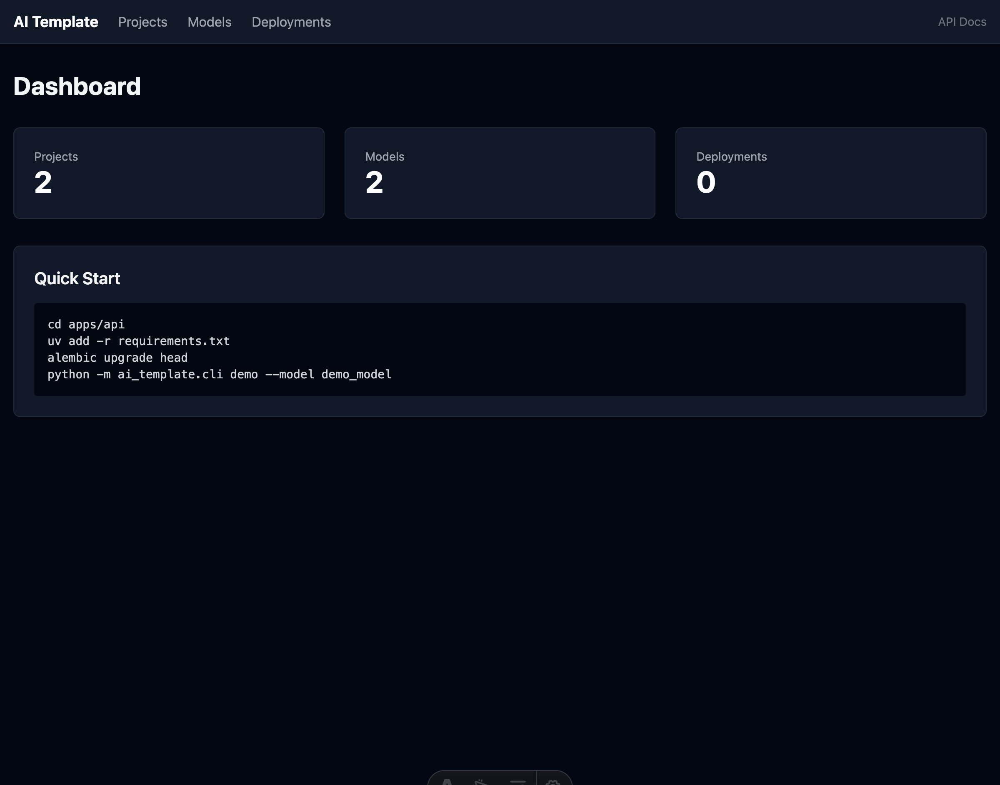

# AI Template Monorepo

> CLI-first monorepo for AI/ML prototyping. Train models, track artifacts, run benchmarks, and ship a dashboard — all from one repo.

[](https://python.org)
[](https://typescriptlang.org)
[](./LICENSE)
[](./CONTRIBUTING.md)



## Why?

Starting an AI project shouldn't require stitching together five repos. This template gives you a **FastAPI backend** with a full CRUD API, mocked training pipeline, artifact tracking, and benchmark runner — paired with an **Astro dashboard** to visualize everything. One `make demo` and you're up.

Built for AI/ML engineers who want structure, and full-stack devs who want to ship fast.

## Features

- **Monorepo structure** — API + Web in one repo, shared tooling
- **CLI-first workflow** — train, serve, migrate, and scaffold from the terminal
- **Training pipeline** — mocked training with Rich progress bars, saves `.pkl` artifacts
- **Benchmark runner** — run inference benchmarks against saved models, compute stats
- **Dark-themed dashboard** — Astro + Tailwind UI for projects, models, and deployments
- **Database migrations** — Alembic with versioned migration files
- **Docker-ready** — `docker compose up` and both services are running
- **Automated quality** — Husky pre-commit (Biome + Ruff) and pre-push (pytest + Vitest) hooks

## Quick Start

```bash
# 1. Install dependencies
make install

# 2. Run demo (trains model + starts server)
make demo

# 3. Open API docs
open http://127.0.0.1:8000/scalar
```

## Project Structure

```
├── apps/
│   ├── api/                # FastAPI + SQLAlchemy + SQLite + Alembic
│   │   ├── ai_template/
│   │   │   ├── server.py   # FastAPI app
│   │   │   ├── cli.py      # Typer CLI
│   │   │   ├── train.py    # Training pipeline
│   │   │   ├── db.py       # SQLAlchemy models
│   │   │   └── routes/     # API route modules
│   │   ├── alembic/        # Database migrations
│   │   └── tests/          # pytest tests
│   └── web/                # Astro + Tailwind
│       └── src/pages/      # Dashboard pages
├── Makefile                # All dev commands
├── docker-compose.yml      # Container orchestration
└── .husky/                 # Git hooks
```

## Tech Stack

| Layer | Tech | Purpose |
|-------|------|---------|
| **Backend** | [FastAPI](https://fastapi.tiangolo.com) | Async API framework |
| | [SQLAlchemy](https://www.sqlalchemy.org) | ORM + database models |
| | [Alembic](https://alembic.sqlalchemy.org) | Database migrations |
| | [Typer](https://typer.tiangolo.com) | CLI framework |
| | [Rich](https://rich.readthedocs.io) | Terminal formatting |
| | [Ruff](https://docs.astral.sh/ruff/) | Python linter + formatter |
| **Frontend** | [Astro](https://astro.build) | Static/SSR framework |
| | [Tailwind CSS](https://tailwindcss.com) | Utility-first styling |
| | [Biome](https://biomejs.dev) | JS/TS linter + formatter |
| **Infra** | [Docker](https://docker.com) | Containerization |
| | [Husky](https://typicode.github.io/husky/) | Git hooks |
| | [Vitest](https://vitest.dev) | JS test runner |

## CLI Reference

All commands run from `apps/api/`:

```bash
python -m ai_template.cli <command> [options]
```

| Command | Description | Example |
|---------|-------------|---------|
| `create-project <name>` | Scaffold a new project directory | `create-project my-project` |
| `train <name>` | Run mocked training, save artifact | `train my-model --epochs 50` |
| `migrate` | Run Alembic migrations | `migrate` |
| `serve` | Start API server with hot reload | `serve --host 0.0.0.0 --port 8000` |
| `demo` | Train + serve in sequence | `demo --model demo_model` |
| `lint` | Run Ruff linter + formatter | `lint` |

## API Reference

Base URL: `http://localhost:8000/api/v1/`

| Resource | Endpoints | Notes |
|----------|-----------|-------|
| **Projects** | `GET/POST` `/projects`, `GET/PUT/PATCH/DELETE` `/projects/{id}` | Full CRUD |
| **Models** | `GET/POST` `/models`, `GET/PUT/PATCH/DELETE` `/models/{id}` | Linked to projects |
| **Training Scripts** | `GET/POST` `/training-scripts`, `GET/PUT/PATCH/DELETE` `/training-scripts/{id}` | Linked to models |
| **Deployments** | `GET/POST` `/deployments`, `GET/PUT/PATCH/DELETE` `/deployments/{id}` | Status tracking |
| **Benchmarks** | `GET` `/benchmarks`, `GET` `/benchmarks/{id}`, `POST` `/benchmarks/run` | Run inference benchmarks |
| **Training** | `POST` `/train` | Trigger training job |
| **Health** | `GET` `/health` | Service health check |
| **Docs** | `GET` `/scalar` | Interactive API docs |

## Docker

```bash
docker compose up -d
# API: http://localhost:8000
# Web: http://localhost:4321
```

## Development

| Command | Description |
|---------|-------------|
| `make install` | Install all dependencies (API + Web) |
| `make dev` | Run API + Web in parallel |
| `make dev-api` | FastAPI on `:8000` with hot reload |
| `make dev-web` | Astro on `:4321` with hot reload |
| `make test` | Run all tests (pytest + Vitest) |
| `make test-api` | Python tests only |
| `make test-web` | JS tests only |
| `make lint` | Lint all (Ruff + Biome) |
| `make format` | Format all (Ruff + Biome) |
| `make migrate` | Run database migrations |
| `make demo` | Train model + start server |
| `make docker-build` | Build Docker images |
| `make docker-up` | Start containers |
| `make docker-down` | Stop containers |
| `make update` | Upgrade all dependencies |

## Contributing

1. Fork the repo
2. Create a feature branch (`git checkout -b feat/my-feature`)
3. Commit your changes — pre-commit hooks run automatically
4. Push and open a PR

Pre-commit hooks lint with Biome (JS) and Ruff (Python). Pre-push hooks run the full test suite.

## License

[MIT](./LICENSE)
